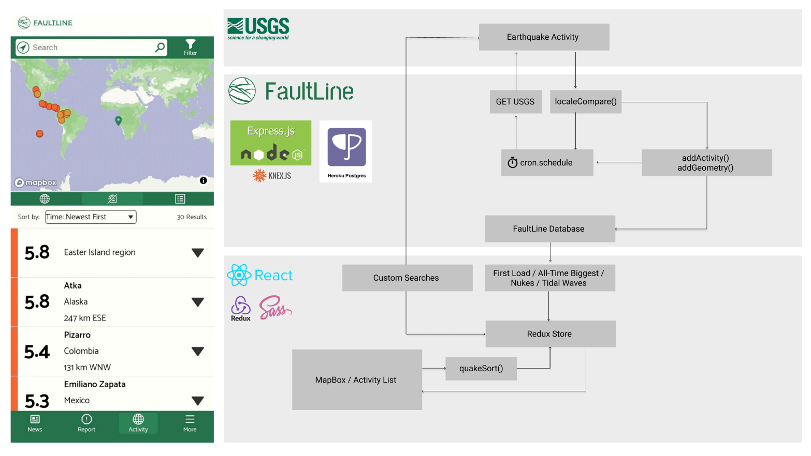
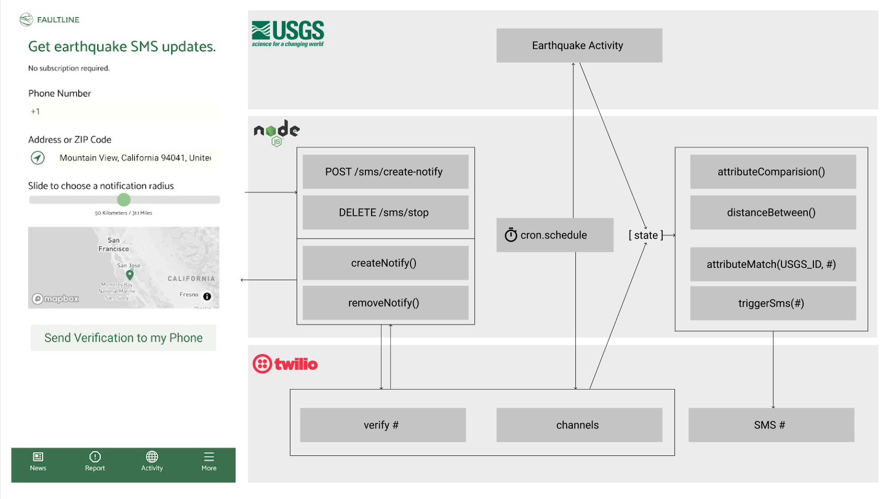
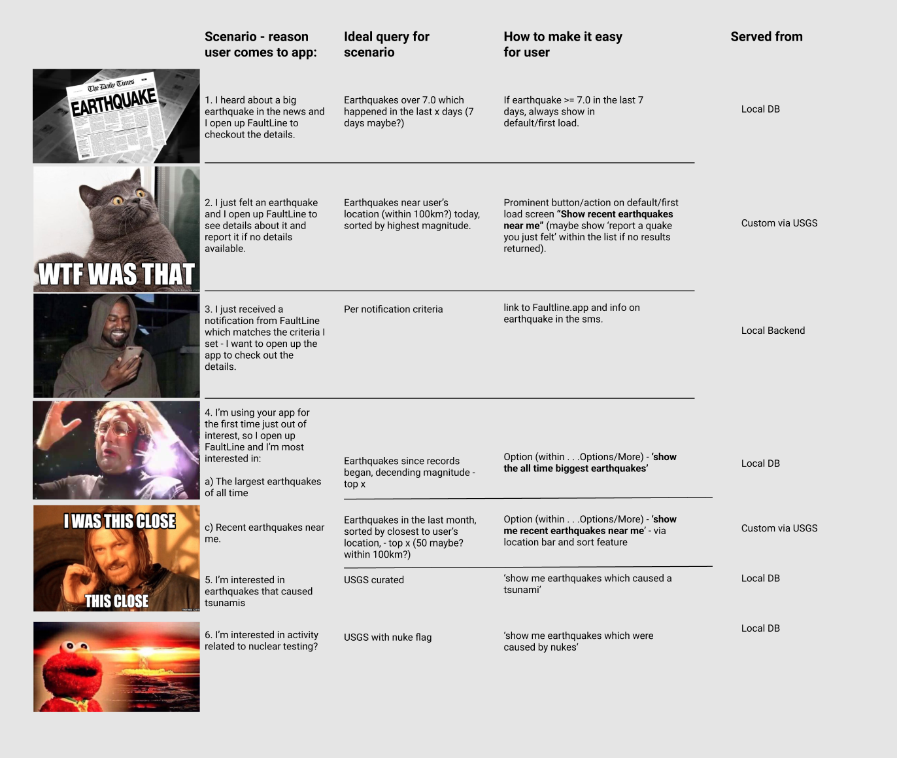

This is the backend for FaultLine. The associated frontend repo is here: https://github.com/Lambda-School-Labs/quake-fe

**Endpoints:**
- /api/activity/first-load
- /api/activity/alltime-biggest
- /api/nukes/boom
- /api/tsunami/splash

## /api/activity/first-load
- Deployed version here:  
https://quakelabs-be-production.herokuapp.com/api/activity/first-load

This is the endpoint used for the first load of our app, before the user has specified any custom search filters.
We have designed it to be fast and efficient by limiting the results to 30 earthquakes, in the last 7 days by decending magnitude.
If the reason you come to the FaultLine app is because you heard about a large earthquake within the last few days, it will show immediatley before applying any filter.
We refresh the earthquakes every five minutes via a scheduled cron job and we update our local database if there is a change in earthquakes.
A checksum is used to determine if there are any changes to the latest earthquakes retrieved from USGS compared with what we already have in the local database.
The system does not overwrite the existing earthquake data in the local database unless there is a change, this ensures we do not waste server resources.
Storing the data ensures that FaultLine will still work, even if the USGS API is down and ensures a consistent user experience.

## /api/activity/alltime-biggest
- Deployed version here:  
https://quakelabs-be-production.herokuapp.com/api/activity/alltime-biggest  

This is the endpoint used for the alltime biggest earthquakes globally.
We added this to our local database as it is an interesting list of earthquakes which many of our users would be interested in seeing.
Adding this endpoint allows FaultLine to have a quick link to the query without the user changing any filters and it ensures that we always have this info even if USGS API is down which ensures a consistent user experience. 
We refresh the earthquakes once a day at 12.00 AM server time and we update our local database if there is a change in earthquakes.
A checksum is used to determine if there are any changes to the latest earthquakes retrieved from USGS compared with what we already have in the local database.
The system does not overwrite the existing earthquake data in the local database unless there is a change, this ensures we do not waste server resources.

## /api/nukes/boom
- Deployed version here:  
https://quakelabs-be-production.herokuapp.com/api/nukes/boom  

This is the endpoint used for earthquakes which were trigged from the explosion of a nuclear bomb. It shows top 10 based on the highest earthquake magnitude.
We added this to our local database as it is an interesting list of earthquakes which many of our users would be interested in seeing.
Adding this endpoint allows FaultLine to have a quick link to the query without the user changing any filters and it ensures that we always have this info even if USGS API is down which ensures a consistent user experience. 
We refresh the earthquakes once a day at 12.00 AM server time and we update our local database if there is a change in earthquakes.
A checksum is used to determine if there are any changes to the latest earthquakes retrieved from USGS compared with what we already have in the local database.
The system does not overwrite the existing earthquake data in the local database unless there is a change, this ensures we do not waste server resources.

## /api/tsunami/splash
- Deployed version here:  
https://quakelabs-be-production.herokuapp.com/api/tsunami/splash  

This is the endpoint used for earthquakes which resulted in a notable tsunami. It shows a list of notable tsunamis based on those with earthquake data in this wikipedia article: https://en.wikipedia.org/wiki/List_of_tsunamis
The tsunamis were curated by the team and added manually to our database via a seed file as the USGS API does not contain data on tsunamis.
We added this to our local database as it is an interesting list of earthquakes which many of our users would be interested in seeing.
As this list was curated and added via seed file, there is no associated cron job as the list does not update or change.

All endpoints have been designed to mirror the JSON Object format of USGS so that a frontend client does not need to handle the received data differently regardless if it retrieved from USGS or from one of these endpoints.  

# Data Flows

# Usage Scenarios

